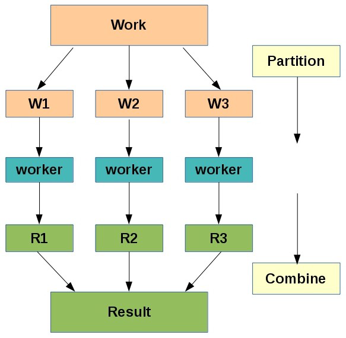
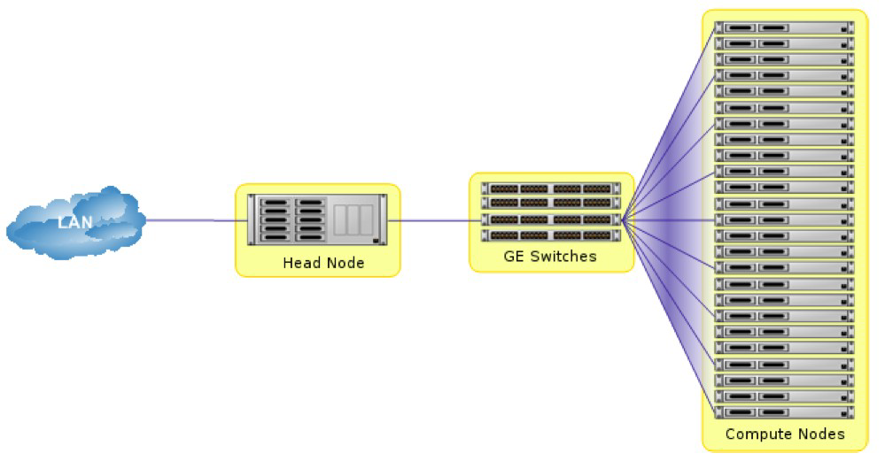

# What is Oswald?

Oswald is one of [Northumbria University's](https://www.northumbria.ac.uk) HPC clusters, which is available to Northumbria research staff in the Faculty of Engineering and Environment. Oswald is named after Oswald the King of Northumbria (c604-5 August 642).

## What is Supercomputing?

Supercomputing is defined as the most powerful form of computing at the present time. Supercomputers are therefore the biggest, fastest computers that exist right now. The definition of 'supercomputer' changes over time as supercomputers get bigger and faster. As a rule of thumb, a supercomputer is at least 100 times as powerful as a PC.

Supercomputing is also known as High Performance Computing (HPC) or High End Computing (HEC).

HPC has two main advantages:

- **Speed**: Many problems that are interesting to scientists and engineers would take **a very long time to run on a PC** - months or even years. But a problem that would take a month on a PC might only take a few hours on a supercomputer.

- **Size**: Many problems that are interesting to scientists and engineers **can’t fit on a PC** - usually because they need more than a few GB of RAM, or more than a few 100GB of disk space.

HPC takes a divide and conquer approach to solve big problems – dividing a problem into parts, assigning to workers, and then combining the results as illustrated below.

### Clusters

Modern supercomputers are usually cluster computers - where multiple (already quite powerful) computers are connected together to form a powerful compute resource. As such, 'cluster' is often used as another term for supercomputer in the context of HPC.

A cluster consists of a head (master) node and several small(er) computers called compute nodes, all connected together with a high speed interconnecting network (Oswald uses a 1GB/10GB/IB interconnect). Software allows the head and compute nodes to communicate over the interconnection network.

The diagram below shows a typical cluster with Gigabit Ethernet interconnect. A resource manager on the head node allocates work to the compute nodes.

## What Are Supercomputers Used For?

Supercomputers are used in a wide range of fields of research. Oswald is commonly used in the following research areas:

- Solar Physics simulation and analysis
- Climate modelling
- Ice sheet and glacier modelling
- Physics analysis and simulations
- Mechanical Engineering modelling using CFD
- AI and Deep Learning

## Oswald Hardware Specifications

| Num | Type               | CPU                                                        | GPU                                                                 | RAM   | Storage             |
|-----|--------------------|------------------------------------------------------------|---------------------------------------------------------------------|-------|---------------------|
| 1   | Head Node          | Dual Intel Xeon E5-2630 v4 10 Core 2.2GHz (20 cores total) |                                                                     | 64GB  | 1TB SSD, 185TB HDD  |
| 32  | Compute Node       | Dual Intel Xeon E5-2680 v4 14 Core 2.4GHz (28 cores total) |                                                                     | 64GB  | 120GB SSD           |
| 1   | GPU Node           | Intel Skylake SKL-SP 4112 4 Core 2.6GHz                    | 2 x NVIDIA Tesla V100 (each with 640 Tensor cores, 5120 CUDA cores) | 64GB  | 240GB SSD           |
| 1   | Visualisation Node | Dual Intel Xeon E5-2630 v4 10 Core 2.2GHz (20 cores total) | NVIDIA Tesla M60 (4096 CUDA Cores)                                  | 256GB | 240GB SSD, 12TB HDD |

??? todo
    `/local` on some compute nodes is 184GB (see [Storage and Filesystems](quickstart/storage-and-filesystems.md)) - do these nodes have larger drives than 120GB?

Oswald also has:

- An Intel Omnipath 100Gb interconnect
- 88TB of Lustre parallel storage
- Hyperthreading enabled on all compute nodes, allowing 56 threads to run

!!! note
    Hyperthreading does **not** mean a doubling of speed, although some jobs will run faster than just using 28 cores.
